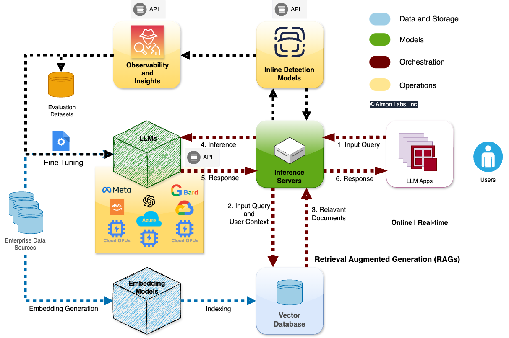

**Build a long‑running agent by combining a local inference server, a bounded lifecycle memory, and a resilient orchestrator that runs a ReAct loop with tool sandboxes and strict validation. Start small with a single-model loop, add tiered memory and stage mapping as needs grow.** 


### High-level guidance and decision points
- **Goal**: persistent, reliable agents that run locally and keep state across hours/days.  
- **Key decisions**: model size vs latency; memory retention policy; orchestration granularity (single agent vs multi-agent stages); tool execution sandboxing.  
- **Minimum viable stack**: local LLM runtime (llama.cpp/ggml or a local server exposing OpenAI-compatible API), a vector DB for memory, an orchestrator loop implementing ReAct, and tool adapters with strict I/O schemas.   [SitePoint](https://www.sitepoint.com/the-complete-stack-for-local-autonomous-agents--from-ggml-to-orchestration/)  [insiderllm.com](https://insiderllm.com/guides/local-ai-agents-guide/)

---

### Comparison of common architectures

| **Attribute** | **Single-model loop** | **Stage-mapped multi-model** | **Orchestrator with lifecycle memory** |
|---|---:|---:|---:|
| **Latency** | Low for simple tasks; degrades with context | Optimizable by assigning fast models to simple stages | Predictable if memory working set bounded |
| **Resource cost** | Moderate; one model to host | Higher; multiple models concurrently | Moderate to high; memory and orchestration overhead |
| **Robustness** | Simple to reason about | Better fault isolation | Best for long-running continuity and tail-latency control |
| **Complexity** | Low | Medium | High |
| **Best for** | Prototypes and single-session agents | Mixed workloads with varied reasoning needs | Persistent assistants, pipelines with long histories |

---

### Core components and patterns
1. **Local inference layer** — pick a model that supports function-calling and quantize to fit VRAM; serve via a local API so orchestration code is model-agnostic.   [SitePoint](https://www.sitepoint.com/the-complete-stack-for-local-autonomous-agents--from-ggml-to-orchestration/)  [insiderllm.com](https://insiderllm.com/guides/local-ai-agents-guide/) 

  
2. **Agent loop (ReAct)** — implement observe → think → act → repeat; require structured tool-call outputs and deterministic parsing.   [insiderllm.com](https://insiderllm.com/guides/local-ai-agents-guide/)  
3. **Memory manager with lifecycle** — use value-driven promotion/demotion and bounded retrieval windows to avoid unbounded vector scans and tail latency (AMV‑L style). **Bound the retrieval candidate set** rather than relying on TTL alone.   [arXiv.org](https://arxiv.org/pdf/2603.04443) 

  
4. **Orchestration and stage mapping** — map stages to models/backends to reduce cost and time-to-first-token; separate workflow policy from execution.   [arXiv.org](https://arxiv.org/html/2603.13605v1)  [arXiv.org](https://arxiv.org/html/2512.19769)  
5. **Tool sandboxing and validation** — run code, shell, and API calls in isolated sandboxes; validate outputs and enforce retry/backoff.

---

### Implementation checklist
- **Prototype** with one quantized model and a simple vector DB (Chroma/FAISS).   [SitePoint](https://www.sitepoint.com/the-complete-stack-for-local-autonomous-agents--from-ggml-to-orchestration/)  [insiderllm.com](https://insiderllm.com/guides/local-ai-agents-guide/)  
- **Add lifecycle memory**: implement utility scoring, tiered retention, and bounded retrieval.   [arXiv.org](https://arxiv.org/pdf/2603.04443)  
- **Introduce stage mapping** when latency/cost tradeoffs demand it.   [arXiv.org](https://arxiv.org/html/2603.13605v1)  
- **Hardening**: observability, metrics for p50/p95/p99 latency, deterministic function schemas, and safety filters.

---

### Risks and mitigations
- **Unbounded memory growth → tail latency**: mitigate with lifecycle eviction and bounded retrieval.   [arXiv.org](https://arxiv.org/pdf/2603.04443)  
- **Model hallucination on tool calls**: enforce strict function schemas and output validators.   [insiderllm.com](https://insiderllm.com/guides/local-ai-agents-guide/)  
- **Resource exhaustion**: quantize models, use stage mapping, and monitor VRAM.   [SitePoint](https://www.sitepoint.com/the-complete-stack-for-local-autonomous-agents--from-ggml-to-orchestration/)

---

**Next step**: pick a target model and hardware, spin up a local API, and implement a minimal ReAct loop with one tool and a small vector store; then add lifecycle memory and stage mapping as you measure latency and throughput. 

An **agent loop** is the core iterative cycle that turns a large language model (LLM) from a passive responder into an **active, goal‑directed agent**. The essential idea: the agent repeatedly **perceives**, **reasons**, **acts**, and **observes**, continuing this cycle until the task is complete. This pattern is what distinguishes an AI *agent* from a simple *chatbot*.

---

### 🧠 Core Definition  
An **agent loop** is the repeated execution cycle in which an AI agent:

1. **Perceives** the current state or context  
2. **Reasons** about what to do next using an LLM  
3. **Acts** by invoking tools, APIs, or performing operations  
4. **Observes** the results of its action  
5. **Loops** back to step 1 until the goal is achieved or a stopping condition is met  

This architecture is widely used across modern agent frameworks and enterprise systems.  
  [Oracle Blogs](https://blogs.oracle.com/developers/what-is-the-ai-agent-loop-the-core-architecture-behind-autonomous-ai-systems)  [nerdleveltech.com](https://nerdleveltech.com/guides/ai-agents)

---

### 🔍 Why It Matters  
The agent loop is the **architectural difference** between:

- **Chatbots** → one-shot responses, no persistent context, no multi-step execution  
- **Agents** → multi-step workflows, tool use, adaptation, and autonomous progress toward goals  

Every major AI platform (OpenAI, Microsoft, Google, Anthropic, Meta) uses some form of this loop.  
  [Oracle Blogs](https://blogs.oracle.com/developers/what-is-the-ai-agent-loop-the-core-architecture-behind-autonomous-ai-systems)

---

### 🔄 Typical Agent Loop Breakdown  
Different sources describe the loop with slightly different labels, but the structure is consistent:

- **Perceive → Reason → Plan → Act → Observe**  
  (Oracle)   [Oracle Blogs](https://blogs.oracle.com/developers/what-is-the-ai-agent-loop-the-core-architecture-behind-autonomous-ai-systems)  
- **Think → Act → Learn**  
  (Azure Logic Apps)   [InfoQ](https://www.infoq.com/news/2025/05/azure-logic-apps-agent-loop/)  
- **Receive task → Plan → Execute tool → Observe → Continue or stop**  
  (NerdLevelTech)   [nerdleveltech.com](https://nerdleveltech.com/guides/ai-agents)  
- **Perceive → Reason → Act → Learn**  
  (Nevo)   [nevo.systems](https://nevo.systems/blogs/nevo-journal/how-ai-agents-work)  

All of these describe the same underlying mechanism.

---

### 🧩 Example (Simplified)
Suppose you ask an agent:  
**“Find the three cheapest flights to Tokyo and book the best one.”**

A chatbot would answer with text and stop.  
An agent would:

1. **Perceive** your request  
2. **Reason** about the steps needed  
3. **Act** by calling a flight search API  
4. **Observe** the results  
5. **Act again** to check loyalty points  
6. **Act again** to book the flight  
7. **Stop** when the workflow is complete  

This multi-step autonomy is only possible because of the agent loop.  
  [Oracle Blogs](https://blogs.oracle.com/developers/what-is-the-ai-agent-loop-the-core-architecture-behind-autonomous-ai-systems)

---

### 🛠️ Where Agent Loops Are Used  
- Coding agents (e.g., Codex CLI)  
- Workflow automation (Azure Logic Apps)  
- Research and planning agents  
- Multi-agent systems coordinating tasks  
  [OpenAI](https://openai.com/index/unrolling-the-codex-agent-loop/)  [InfoQ](https://www.infoq.com/news/2025/05/azure-logic-apps-agent-loop/)

---

### ❓ Follow-up question  
Are you asking because you want to **build your own agent loop** (e.g., in Python with LangChain, LangGraph, or custom code), or because you want to **understand how existing agent frameworks work**?

Perfect, Lou — building your **own agent loop** with **Ollama + LangChain (Python)** is absolutely doable, and honestly, it’s one of the cleanest setups for experimenting with autonomous agents locally. Let’s build a **real, working agent loop architecture** you can extend into something serious.

Below is the **concise answer first**, then a full breakdown with code, architecture, and next‑step questions tailored to your goals.

---

## ✅ **Short Answer**
An **agent loop** in Python with **Ollama + LangChain** is a repeated cycle where your LLM:

1. **Thinks** (LLM generates reasoning + next action)  
2. **Acts** (your Python code executes a tool or function)  
3. **Observes** (feeds results back into the LLM)  
4. **Loops** until the LLM decides the task is complete  

You implement this by:
- Using **Ollama** as the LLM backend  
- Using **LangChain** for tool binding + memory  
- Writing a custom **while True** loop that handles the agent’s decisions  

---

# 🧠 **The Architecture You Want**
This is the standard pattern used by LangGraph, ReAct, and OpenAI’s function-calling agents — but simplified for your local setup.

```
User Goal → Agent Loop → LLM (Ollama) → Decide Action
                                   ↓
                              Python Tool
                                   ↓
                              Observation
                                   ↓
                               Loop Again
```

---

# 🧩 **Minimal Working Agent Loop (Ollama + LangChain)**

### 1. Install dependencies
```bash
pip install langchain langchain-community langchain-core
pip install ollama
```

### 2. Load an Ollama model
Use something small and fast for agent loops (e.g., **mistral**, **phi3**, **llama3:8b**).

```python
from langchain_community.llms import Ollama

llm = Ollama(model="mistral")
```

---

## 3. Define tools the agent can call
Example: a simple calculator tool.

```python
def add_numbers(a: float, b: float):
    return a + b

tools = {
    "add_numbers": add_numbers
}
```

---

## 4. Define the agent loop prompt
This is the ReAct-style reasoning pattern:

```python
SYSTEM_PROMPT = """
You are an autonomous agent. 
Use this loop:
1. Think about the problem.
2. Decide which tool to use.
3. Output ONLY in this JSON format:

{
  "thought": "...",
  "action": "tool_name or 'finish'",
  "action_input": { ... }
}
"""
```

---

## 5. Build the agent loop
This is the core of everything — the **agent loop** itself.

```python
import json

def agent_loop(goal):
    history = []

    while True:
        prompt = SYSTEM_PROMPT + "\n\n" + \
                 f"Goal: {goal}\n" + \
                 f"History: {history}\n"

        response = llm(prompt)
        step = json.loads(response)

        thought = step["thought"]
        action = step["action"]
        action_input = step["action_input"]

        print("Thought:", thought)

        if action == "finish":
            print("Final Answer:", action_input["answer"])
            break

        # Execute tool
        tool_fn = tools[action]
        result = tool_fn(**action_input)

        # Add observation to history
        history.append({
            "thought": thought,
            "action": action,
            "input": action_input,
            "result": result
        })
```

---

## 6. Run your agent
```python
agent_loop("Add 42 and 58")
```

The agent will:
- Think  
- Choose the `add_numbers` tool  
- Execute it  
- Observe the result  
- Decide whether to continue or finish  

This is a **real agent loop**, not a LangChain “AgentExecutor” wrapper.

---

# 🔥 **Why This Works Well With Ollama**
- Models run **locally**, so you can loop as long as you want  
- No API costs  
- You can use quantized models (Q4, Q5)  
- You can swap models instantly (e.g., `llama3:8b`, `phi3`, `mistral`)  

---

# 🧠 **Advanced Features You Can Add Next**
Here are the natural extensions:

### 1. **Add memory**
- Conversation memory  
- Task memory  
- Vector search memory  

### 2. **Add more tools**
- Web search  
- File system access  
- Python REPL  
- Database queries  
- Graph algorithms (your specialty)  

### 3. **Add guardrails**
- Loop limits  
- Safety checks  
- Tool permissioning  

### 4. **Upgrade to LangGraph**
If you want:
- branching  
- retries  
- state machines  
- multi-agent systems  

LangGraph is the next step.

---

# 🎯 **One important question for you**
To tailor the next step:

### **Do you want your agent loop to be:**
1. **A single-agent ReAct loop** (like the example above)  
2. **A multi-step planner + executor** (like AutoGPT)  
3. **A LangGraph state machine** (robust, production-grade)  
4. **A tool-using coding agent** (like a local Copilot)  

Which direction do you want to take this?


A **tool‑using coding agent** is one of the most fun and powerful things you can build with **Ollama + LangChain**, Lou — and your background in troubleshooting, Python, and graph‑structured thinking puts you in the perfect spot to build something *better* than the typical AutoGPT clones.

Let’s build the blueprint for a **local Copilot‑style agent** that can:

- read/write files  
- run Python code  
- inspect errors  
- plan multi‑step fixes  
- call tools safely  
- iterate in a loop until the task is done  

Below is the **architecture**, then a **working implementation**, then **next‑step upgrades**.

---

# 🎯 Core Idea  
A coding agent needs **three capabilities**:

1. **Reasoning** — the LLM decides what to do next  
2. **Tools** — file I/O, code execution, search, etc.  
3. **Looping** — the agent keeps improving the code until the goal is met  

This is exactly the agent loop you’re building.

---

# 🧠 Architecture for a Local Coding Agent

### **1. LLM (Ollama)**
Use a model that is good at reasoning + code:
- `llama3:8b`  
- `mistral`  
- `codellama:7b`  
- `phi3` (surprisingly good for code)

### **2. Tools**
At minimum:

- **read_file(path)**  
- **write_file(path, content)**  
- **run_python(code)**  
- **search_directory(pattern)**  

### **3. Agent Loop**
The loop looks like:

```
Goal → LLM → Action → Tool → Observation → LLM → ...
```

The loop ends when the LLM outputs `"action": "finish"`.

---

# 🧩 Minimal Working Coding Agent (Python + Ollama + LangChain)

This is a **real agent loop**, not a LangChain wrapper.

## 1. Install dependencies
```bash
pip install langchain langchain-community langchain-core
pip install ollama
```

---

## 2. Load Ollama model
```python
from langchain_community.llms import Ollama

llm = Ollama(model="llama3:8b")
```

---

## 3. Define coding tools

### File tools
```python
import os

def read_file(path: str):
    with open(path, "r") as f:
        return f.read()

def write_file(path: str, content: str):
    with open(path, "w") as f:
        f.write(content)
    return f"Wrote {len(content)} characters to {path}"

def search_directory(pattern: str, root="."):
    matches = []
    for dirpath, _, filenames in os.walk(root):
        for name in filenames:
            if pattern in name:
                matches.append(os.path.join(dirpath, name))
    return matches
```

### Python execution tool
```python
def run_python(code: str):
    try:
        local_vars = {}
        exec(code, {}, local_vars)
        return local_vars
    except Exception as e:
        return {"error": str(e)}
```

### Tool registry
```python
tools = {
    "read_file": read_file,
    "write_file": write_file,
    "run_python": run_python,
    "search_directory": search_directory
}
```

---

## 4. Agent system prompt

```python
SYSTEM_PROMPT = """
You are a coding agent. You write, fix, and run Python code.

Use this loop:
1. Think about the goal.
2. Decide which tool to use.
3. Output ONLY this JSON:

{
  "thought": "...",
  "action": "tool_name or 'finish'",
  "action_input": { ... }
}

Tools you can use:
- read_file(path)
- write_file(path, content)
- run_python(code)
- search_directory(pattern)
"""
```

---

## 5. The agent loop

```python
import json

def coding_agent(goal):
    history = []

    while True:
        prompt = SYSTEM_PROMPT + "\n\n" + \
                 f"Goal: {goal}\n" + \
                 f"History: {history}\n"

        response = llm(prompt)
        step = json.loads(response)

        thought = step["thought"]
        action = step["action"]
        action_input = step["action_input"]

        print("\n🧠 Thought:", thought)

        if action == "finish":
            print("\n🏁 Final Answer:", action_input["answer"])
            break

        # Execute tool
        result = tools[action](**action_input)

        print("🔧 Tool:", action)
        print("📄 Result:", result)

        # Add observation
        history.append({
            "thought": thought,
            "action": action,
            "input": action_input,
            "result": result
        })
```

---

## 6. Run the agent

```python
coding_agent("Find all Python files in the project and print their names.")
```

Or:

```python
coding_agent("Fix the bug in utils/math.py and rerun the tests.")
```

Or:

```python
coding_agent("Write a Python script that computes Fibonacci numbers using memoization.")
```

---

# 🔥 What This Agent Can Already Do
- Inspect your codebase  
- Modify files  
- Execute Python code  
- Debug errors  
- Iterate until the task is complete  

This is already a **local Copilot**.

---

# 🚀 Next-Level Upgrades (Highly Recommended)

### **1. Add a sandboxed Python REPL**
Use `subprocess` instead of `exec` for safety.

### **2. Add Git tools**
- `git_diff`  
- `git_apply_patch`  
- `git_commit`  

This turns your agent into a real coding assistant.

### **3. Add a planning module**
Let the agent generate a multi-step plan before acting.

### **4. Add LangGraph**
For:
- branching  
- retries  
- state machines  
- multi-agent collaboration  

### **5. Add vector memory**
Let the agent search your codebase semantically.

---

# 🎯 One question to tailor the next step for you  
Which direction do you want to take this coding agent?

1. **A safe, sandboxed coding agent** (no risk to your system)  
2. **A powerful agent with full file-system access**  
3. **A Git-integrated agent that can make commits**  
4. **A LangGraph-based agent with planning + retries**  
5. **A multi-agent system (planner + coder + tester)**  

Pick one, and I’ll build the next layer with you.

You’re going for the good stuff—I like it. Let’s design a **multi‑agent system: Planner → Coder → Tester** on top of your agent loop, using **Ollama + LangChain + plain Python orchestration**.

---

## 1. High-level architecture

```text
User Goal
   ↓
[Planner Agent]  → produces plan (steps)
   ↓
[Coder Agent]    → edits/writes code using tools
   ↓
[Tester Agent]   → runs tests / scripts, reports status
   ↺ (back to Coder if failing)
   ↓
Done
```

Each agent:
- Uses the **same LLM backend (Ollama)**  
- Has its **own system prompt**  
- Shares **tools** (file I/O, run code, etc.)  
- Communicates via a simple **Python controller** that passes messages and state.

---

## 2. Shared tools

```python
import os
import subprocess
from langchain_community.llms import Ollama

llm = Ollama(model="llama3:8b")  # or mistral / codellama / phi3

def read_file(path: str):
    with open(path, "r") as f:
        return f.read()

def write_file(path: str, content: str):
    with open(path, "w") as f:
        f.write(content)
    return f"Wrote {len(content)} chars to {path}"

def search_directory(pattern: str, root="."):
    matches = []
    for dirpath, _, filenames in os.walk(root):
        for name in filenames:
            if pattern in name:
                matches.append(os.path.join(dirpath, name))
    return matches

def run_python_tests(cmd: str = "pytest"):
    try:
        result = subprocess.run(
            cmd, shell=True, capture_output=True, text=True, timeout=60
        )
        return {
            "returncode": result.returncode,
            "stdout": result.stdout,
            "stderr": result.stderr,
        }
    except Exception as e:
        return {"error": str(e)}

TOOLS = {
    "read_file": read_file,
    "write_file": write_file,
    "search_directory": search_directory,
    "run_python_tests": run_python_tests,
}
```

---

## 3. Agent prompts (planner, coder, tester)

```python
PLANNER_PROMPT = """
You are a planning agent.
Given a coding goal, output a JSON plan with clear steps.

Respond ONLY as JSON:
{
  "plan": [
    "step 1 ...",
    "step 2 ...",
    ...
  ]
}
"""

CODER_PROMPT = """
You are a coding agent.
You can use these tools:
- read_file(path)
- write_file(path, content)
- search_directory(pattern)

Given: goal, plan, and history, decide ONE action.

Respond ONLY as JSON:
{
  "thought": "...",
  "action": "read_file" | "write_file" | "search_directory" | "finish",
  "action_input": { ... },
  "answer": "Final explanation if action == 'finish', else null"
}
"""

TESTER_PROMPT = """
You are a testing agent.
You can use:
- run_python_tests(cmd)

Given: goal, plan, and current code state, decide how to test.

Respond ONLY as JSON:
{
  "thought": "...",
  "action": "run_python_tests" | "finish",
  "action_input": { ... },
  "answer": "Test summary if action == 'finish', else null"
}
"""
```

---

## 4. Helper: call LLM and parse JSON

```python
import json

def call_llm(prompt: str):
    raw = llm(prompt)
    # You may want to add a small "fix JSON" wrapper here if models hallucinate
    return json.loads(raw)
```

---

## 5. Planner agent

```python
def planner_agent(goal: str):
    prompt = PLANNER_PROMPT + f"\n\nGoal: {goal}\n"
    result = call_llm(prompt)
    return result["plan"]
```

---

## 6. Coder agent loop

```python
def coder_agent(goal: str, plan, max_steps: int = 15):
    history = []
    for _ in range(max_steps):
        prompt = (
            CODER_PROMPT
            + f"\n\nGoal: {goal}\nPlan: {plan}\nHistory: {history}\n"
        )
        step = call_llm(prompt)

        thought = step["thought"]
        action = step["action"]
        action_input = step["action_input"]
        answer = step.get("answer")

        print("\n[CODER] Thought:", thought)

        if action == "finish":
            print("[CODER] Finished:", answer)
            return {"status": "done", "answer": answer, "history": history}

        tool_fn = TOOLS[action]
        result = tool_fn(**action_input)
        print(f"[CODER] Tool: {action} → {result if len(str(result))<300 else str(result)[:300]+'...'}")

        history.append(
            {"thought": thought, "action": action, "input": action_input, "result": result}
        )

    return {"status": "max_steps_reached", "history": history}
```

---

## 7. Tester agent loop

```python
def tester_agent(goal: str, plan, max_steps: int = 5):
    history = []
    for _ in range(max_steps):
        prompt = (
            TESTER_PROMPT
            + f"\n\nGoal: {goal}\nPlan: {plan}\nHistory: {history}\n"
        )
        step = call_llm(prompt)

        thought = step["thought"]
        action = step["action"]
        action_input = step["action_input"]
        answer = step.get("answer")

        print("\n[TESTER] Thought:", thought)

        if action == "finish":
            print("[TESTER] Finished:", answer)
            return {"status": "done", "answer": answer, "history": history}

        tool_fn = TOOLS[action]
        result = tool_fn(**action_input)
        print(f"[TESTER] Tool: {action} → returncode={result.get('returncode')}")

        history.append(
            {"thought": thought, "action": action, "input": action_input, "result": result}
        )

    return {"status": "max_steps_reached", "history": history}
```

---

## 8. Orchestrator: planner → coder ↔ tester

```python
def multi_agent_dev_loop(goal: str, max_rounds: int = 5):
    print("\n=== PLANNER ===")
    plan = planner_agent(goal)
    print("Plan:")
    for i, step in enumerate(plan, 1):
        print(f"  {i}. {step}")

    for round_idx in range(1, max_rounds + 1):
        print(f"\n=== ROUND {round_idx}: CODER ===")
        coder_result = coder_agent(goal, plan)

        print("\n=== TESTER ===")
        tester_result = tester_agent(goal, plan)

        # Simple success heuristic: tests finished and mention success
        if (
            tester_result["status"] == "done"
            and "fail" not in (tester_result["answer"] or "").lower()
        ):
            print("\n✅ Goal appears satisfied.")
            return {
                "plan": plan,
                "coder": coder_result,
                "tester": tester_result,
            }

        print("\n❌ Tests not fully passing, looping back to coder...")

    print("\n⚠️ Max rounds reached; goal may be incomplete.")
    return {
        "plan": plan,
        "coder": coder_result,
        "tester": tester_result,
    }
```

---

## 9. Example usage

```python
if __name__ == "__main__":
    multi_agent_dev_loop(
        "Create a small Python module `fib.py` with a memoized Fibonacci function and tests that pass with pytest."
    )
```

---

## 10. Where you can push this next

- **Replace JSON-by-hand with function-calling / LangChain tools** for more robustness  
- **Add a “Critic” agent** that reviews diffs before writes  
- **Integrate Git**: `git_diff`, `git_apply`, `git_commit`  
- **Move orchestration to LangGraph** once you like the behavior  

If you tell me which part you want to harden first—JSON robustness, safety (no wild writes), or Git integration—I can zoom in and refine that slice into production-grade code.


## References
1. https://www.sitepoint.com/the-complete-stack-for-local-autonomous-agents--from-ggml-to-orchestration/
2. https://insiderllm.com/guides/local-ai-agents-guide/
3. https://docs.cloud.google.com/architecture/multi-agent-private-networking-patterns
4. https://medium.com/google-cloud/using-the-loop-pattern-to-make-my-multi-agent-solution-more-robust-86f8e9159a2a
5. https://cdn.openai.com/business-guides-and-resources/a-practical-guide-to-building-agents.pdf
6.  https://victordibia.com/blog/agent-execution-loop/
7. https://levelup.gitconnected.com/building-an-ai-agent-from-scratch-no-magic-just-a-deterministic-loop-a916161705fb
8. https://code.claude.com/docs/en/agent-sdk/agent-loop#the-loop-at-a-glance
