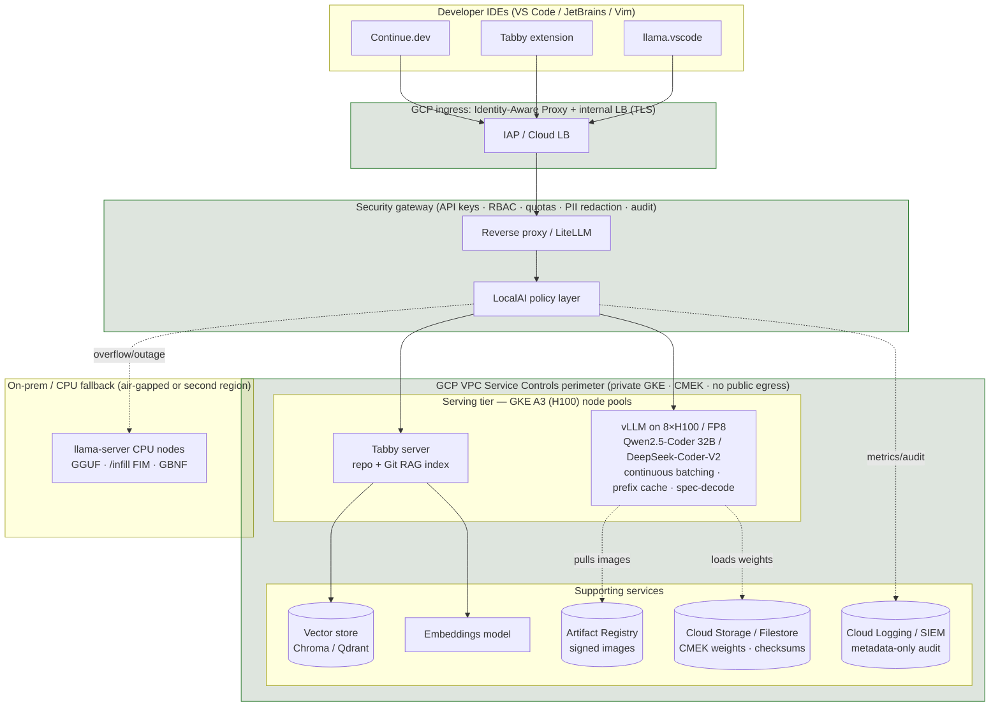

# LLM Hosting for C++ Software Development — Cloud (GCP H100) with On-Prem Fallback

**An evaluation balancing security/data protection against performance/correctness**

> **Context for this report.** Enterprise environment, many developers. The **primary host is
> the cloud**: **GCP containers (GKE) on NVIDIA H100 GPUs** (A3 VM family, 80 GB HBM3 per GPU,
> FP8 Transformer Engine, NVLink/NVSwitch), deployed inside a **VPC-isolated, private** project
> with no public internet exposure. An optional **on-prem / CPU-only fallback** tier (NVIDIA
> servers + `llama-server`) is retained for air-gapped sites, burst overflow, and provider-outage
> resilience. The primary workload is **C++ software development**: code completion
> (fill-in-the-middle), chat-style Q&A over the codebase, refactoring, test generation, and
> review assistance. Every option below is assessed for how it serves that workload while keeping
> **code and prompts inside a tenant boundary you control** — whether that boundary is a GCP VPC
> Service Controls perimeter or an on-prem network. H100-class hardware removes the tight VRAM
> constraints of the original on-prem brief: **full-precision and FP8 serving of large models
> becomes the default**, and aggressive 4-bit quantization becomes optional rather than required.

---

## Table of contents

1. [Executive summary & recommendation](#1-executive-summary--recommendation)
2. [Evaluation criteria](#2-evaluation-criteria)
3. [Per-option deep dives](#3-per-option-deep-dives)
   - [3.1 vLLM](#31-vllm)
   - [3.2 llama.cpp / llama-server](#32-llamacpp--llama-server)
   - [3.3 LocalAI](#33-localai)
   - [3.4 Ollama](#34-ollama)
   - [3.5 LM Studio / llmster](#35-lm-studio--llmster)
   - [3.6 Tabby](#36-tabby)
   - [3.7 Brief: TGI, SGLang, NVIDIA NIM](#37-brief-tgi-sglang-nvidia-nim)
4. [Comparison matrix](#4-comparison-matrix)
5. [Cross-cutting toolchain](#5-cross-cutting-toolchain)
6. [C++-tuned models](#6-c-tuned-models)
7. [IDE integration](#7-ide-integration)
8. [Recommended reference architecture](#8-recommended-reference-architecture)
9. [GCP / GKE deployment on H100](#9-gcp--gke-deployment-on-h100)
10. [Risks & mitigations](#10-risks--mitigations)
11. [Appendix A: VRAM / throughput sizing (incl. H100)](#appendix-a-vram--throughput-sizing-incl-h100)
12. [References](#references)

---

## 1. Executive summary & recommendation

**Bottom line:** Serve a small number of strong code models from a **GKE GPU tier on GCP A3
(H100) nodes running vLLM**, expose them through an **OpenAI-compatible gateway** behind GCP
load balancing + Identity-Aware Proxy, and give developers a coding-assistant experience via
**Tabby** (fill-in-the-middle + repository RAG) and/or **Continue.dev** inside the IDE. Where
native multi-user controls (per-key quotas, RBAC, PII/secret redaction) matter more than raw
throughput, place **LocalAI** in front as a policy gateway. Keep an **on-prem / CPU-only
`llama-server` tier** for air-gapped sites and outage resilience. The whole serving plane lives
inside a **VPC Service Controls perimeter** with **private GKE nodes**, **CMEK-encrypted**
storage, and **no public egress** — H100 capacity buys you full-precision/FP8 serving of large
models, so quantization becomes a performance choice, not a hardware necessity.

> **What changed vs. a pure on-prem build.** With H100s (80 GB HBM3, FP8) you can serve
> **32B–70B code models at FP8/FP16** and even large **MoE** models (DeepSeek-Coder-V2) at high
> concurrency on a single 8×H100 node — quality and throughput both go up. The security problem
> shifts from *"keep the box offline"* to *"prove the cloud tenant is a closed boundary"*:
> VPC Service Controls, private networking, CMEK, Confidential Computing, and disabled
> request-logging replace the air-gap as the data-protection mechanism (see
> [§5.1](#51-security--data-protection) and [§9](#9-gcp--gke-deployment-on-h100)).

### Recommended stack at a glance

| Layer | Choice | Why |
|-------|--------|-----|
| **Cloud infra (host)** | **GCP GKE** on **A3 (H100)** node pools | 8×H100 80 GB HBM3 per node, NVLink/NVSwitch, FP8; private clusters, VPC-SC, CMEK, autoscaling, Artifact Registry. |
| **Primary serving (GPU)** | **vLLM** (Apache-2.0) | Highest throughput per GPU, continuous batching, PagedAttention, FP8 on H100, OpenAI + Anthropic-compatible APIs, structured output, multi-LoRA. |
| **Fallback serving (CPU/on-prem)** | **llama.cpp / `llama-server`** (MIT) | Runs anywhere incl. air-gapped on-prem, GGUF quantization, CPU+partial-GPU offload, GBNF; outage/burst resilience. |
| **Policy gateway** | **LocalAI** (MIT) or **LiteLLM** | Built-in API-key auth, per-key quotas, RBAC, PII redaction, distributed mTLS, drop-in OpenAI API. |
| **Developer UX** | **Tabby** (Apache-2.0) + **Continue.dev** (Apache-2.0) | Self-hostable FIM completion, chat, and repo-aware RAG; self-hosted alternative to GitHub Copilot. |
| **Models (C++)** | **Qwen2.5-Coder (32B)**, **DeepSeek-Coder-V2**, **Codestral** | H100s let you run the largest/highest-quality variants at FP8/FP16; safetensors (vLLM) and GGUF (llama.cpp). |

### When to choose what

- **Most developers, GCP H100 capacity (default) →** vLLM on GKE A3 nodes behind a gateway +
  IAP. Run large models (32B / MoE) at FP8/FP16 for best quality and throughput.
- **Air-gapped sites / regulated workloads that may not use cloud →** on-prem `llama-server`
  with quantized GGUF (the original on-prem design still applies).
- **Outage / burst resilience →** keep the on-prem (or a second-region) `llama-server` tier as a
  warm fallback the gateway can route to.
- **You need native auth, quotas, RBAC, PII redaction without bolting on a separate proxy →**
  put LocalAI in front (or use it as the serving layer for smaller models).
- **You want the lowest-friction single-box demo →** Ollama, **with cloud features explicitly
  disabled** (see [§3.4](#34-ollama)).
- **You only need a Copilot-style coding assistant and minimal ops →** Tabby standalone can
  both serve models *and* provide the IDE experience for small/medium teams.

> ⚠️ **Avoid as the shared service:** LM Studio's GUI-oriented workflow and license terms make
> it a poor fit as a shared production server (see [§3.5](#35-lm-studio--llmster)). Use it for
> individual developer experimentation only.
>
> 🔏 **Managed vs. self-managed on GCP.** You can run vLLM/llama.cpp containers yourself on GKE
> (full control, portable, this report's default) **or** use **Vertex AI** managed endpoints /
> Model Garden (less ops, more provider involvement in the data path). For maximum control over
> where code goes, prefer **self-managed containers on GKE inside a VPC-SC perimeter**.

---

## 2. Evaluation criteria

Each option is graded against the dimensions below. They are weighted for an enterprise that
treats **source code as confidential IP** and must keep it inside a **boundary it controls** —
a **GCP VPC Service Controls perimeter** for the cloud tier, or an **on-prem network** for the
fallback tier — while still wanting a genuinely useful assistant.

| # | Criterion | What it means here |
|---|-----------|--------------------|
| **S1** | **Tenant / network isolation** | Can it run with **no uncontrolled outbound connections** — fully offline on-prem, *or* inside a private GCP VPC-SC perimeter with private endpoints and no public egress? No telemetry, license phone-home, or model auto-download from the public internet. |
| **S2** | **AuthN / AuthZ** | Native API-key auth, RBAC, per-user/per-team scoping, integration with SSO / GCP IAM / Identity-Aware Proxy / reverse proxy. |
| **S3** | **Data protection** | TLS/mTLS in transit, encryption at rest (CMEK on GCP), no prompt/response logging by default, ability to redact PII/secrets, control over where (and whether) requests are persisted, data-residency control over GCP region. |
| **S4** | **Auditability & governance** | Request audit logs, model provenance/signing, reproducible deployments, supply-chain integrity (signed images, GGUF checksums). |
| **P1** | **Throughput** | Aggregate tokens/s across concurrent developers (continuous batching, paged KV cache). |
| **P2** | **Latency** | Time-to-first-token and inter-token latency — critical for inline completion UX. |
| **P3** | **Hardware efficiency** | Tokens/s per GPU and per watt; quantization support; CPU fallback quality. |
| **C1** | **Correctness — structured output** | Grammar/JSON-schema-constrained decoding so generated code/tool calls are syntactically valid. |
| **C2** | **Correctness — grounding** | Quality of RAG integration to ground answers in the actual repository. |
| **O1** | **Operability** | Ease of deploy, scale-out, upgrade, monitoring; Docker/K8s support. |
| **X1** | **C++ fit** | First-class fill-in-the-middle (FIM) support, large context for headers, model availability tuned for C/C++. |
| **L1** | **Licensing** | Permissive license suitable for internal enterprise deployment without commercial restrictions. |

> **Scoring legend** used in the per-option summaries and the [matrix](#4-comparison-matrix):
> ★★★ excellent · ★★ adequate · ★ weak / needs external help.

---

## 3. Per-option deep dives

Each subsection follows the same shape: **overview → architecture → third-party dependencies →
security → performance → correctness → C++ fit → pros/cons**.

### 3.1 vLLM

**Overview.** vLLM is a high-throughput inference and serving engine for LLMs, originally from
UC Berkeley. Its headline innovation is **PagedAttention**, which manages the attention KV
cache like virtual memory (paged, non-contiguous) so the server can pack far more concurrent
requests into GPU memory with minimal fragmentation. Combined with **continuous batching**
(requests join and leave the running batch each step), it delivers the best aggregate
tokens/s per NVIDIA GPU of any option here. License: **Apache-2.0**.

**Architecture.**

- A single-node or multi-node server (`vllm serve <model>`) exposes an **OpenAI-compatible**
  REST API (`/v1/chat/completions`, `/v1/completions`, `/v1/embeddings`) and, in recent
  versions, an **Anthropic-compatible** `/v1/messages` endpoint.
- Tensor parallelism (split a model across GPUs) and pipeline parallelism (split across nodes)
  for large models; **multi-LoRA** serving lets one base model host many lightweight adapters.
- Loads models in **safetensors** (FP16/BF16) and quantized formats (**AWQ, GPTQ, FP8**,
  Marlin kernels); supports **speculative decoding** and **prefix caching** for shared prompts.
- On **H100** it exploits the **FP8 Transformer Engine** and fast **NVLink/NVSwitch** for
  tensor-parallel sharding across the 8 GPUs of a **GCP A3** node — enabling FP8 serving of
  32B–70B models (and large MoE) at high concurrency without 4-bit quantization.
- Scales horizontally behind a load balancer; integrates cleanly with **GKE** (GPU node pools,
  Horizontal Pod Autoscaler, the Prometheus metrics endpoint it exposes).

**Third-party dependencies / technologies involved.** NVIDIA **CUDA** + appropriate driver;
**PyTorch**; Hugging Face **transformers**/**tokenizers** + **safetensors**; **Ray** (for
multi-node/distributed serving); **xFormers**/**FlashAttention** kernels; **xgrammar** /
**outlines** for guided decoding; **NCCL** for multi-GPU collectives; **Prometheus** +
**Grafana** for metrics; container runtime (**Docker**/**containerd**) with the **NVIDIA
Container Toolkit**. On GCP: **GKE** with **A3 (H100)** node pools, the **GKE GPU device
plugin**/NVIDIA GPU Operator, **Artifact Registry** (images), **Cloud Storage**/**Filestore**
(weights), and **Cloud Load Balancing** + **Identity-Aware Proxy** for ingress. Optional front
door: any OpenAI-compatible gateway (e.g. **LiteLLM**, **LocalAI**) for auth/quotas.

**Security & data protection.** vLLM itself is a **serving engine, not a security product**:
it has an optional static API key (`--api-key`) but **no RBAC, no per-user quotas, and no
built-in PII redaction**. For enterprise use you **must** front it with a gateway/reverse
proxy that terminates TLS/mTLS, authenticates users, enforces quotas, and (optionally) redacts
sensitive data. On GCP, place it on **private GKE nodes** inside a **VPC Service Controls**
perimeter with **no public IP**, pull images from **Artifact Registry**, and stage weights on
**CMEK-encrypted** Cloud Storage / Filestore — set `HF_HUB_OFFLINE=1`/`TRANSFORMERS_OFFLINE=1`
so it never contacts Hugging Face. No telemetry by default. **S1 ★★★ (offline on-prem *or*
VPC-SC private) · S2 ★ (needs gateway) · S3 ★★ (TLS via proxy, CMEK at rest, no native redaction).**

**Performance.** Best-in-class. Continuous batching + PagedAttention keep GPUs saturated under
many concurrent developers; prefix caching reuses the KV cache for the shared system prompt /
repo preamble; speculative decoding cuts latency for the inline-completion path. On **H100**,
**FP8** roughly doubles effective throughput vs. FP16 at comparable quality, and NVLink-connected
8×H100 A3 nodes serve 70B/MoE models tensor-parallel with headroom. **P1 ★★★ · P2 ★★★ (with
FP8 + spec-decode/prefix cache) · P3 ★★★.**

**Correctness.** **Structured output** via guided decoding (JSON schema, regex, grammar through
xgrammar/outlines) — useful for tool calls and emitting well-formed code blocks. Grounding is
not built in; you supply RAG context in the prompt (see [§5](#5-cross-cutting-toolchain)).
**C1 ★★★ · C2 ★★ (RAG is your responsibility).**

**C++ fit.** Excellent: serves the strongest open code models (Qwen2.5-Coder, DeepSeek-Coder-V2,
Codestral) at high concurrency, supports long context for large headers, and FIM is achieved by
sending the model's FIM-formatted prompt. The completion endpoint pairs well with Continue.dev /
Tabby's model backend. **X1 ★★★.**

**Pros**

- Highest throughput and GPU efficiency of any option; scales to many developers.
- OpenAI **and** Anthropic-compatible APIs → broad client/IDE compatibility.
- Strong quantization, **FP8 on H100**, speculative decoding, prefix caching, multi-LoRA.
- Apache-2.0; large, active community; first-class Kubernetes/GKE story.

**Cons**

- NVIDIA-centric; **no CPU fallback** worth running for production (pair with llama.cpp).
- No native auth/RBAC/quotas/redaction — **requires a gateway** for enterprise controls.
- Heavier to operate than single-binary options; needs CUDA/driver/version discipline.

---

### 3.2 llama.cpp / llama-server

**Overview.** llama.cpp is a dependency-light **C/C++** inference engine built around the
**GGUF** model format and the **GGML** tensor library. Its bundled **`llama-server`** exposes an
HTTP server with an OpenAI-compatible API. It is the reference choice for **CPU-only and hybrid
CPU+GPU** inference, runs on virtually any hardware (x86, ARM, Apple Silicon, and via partial
offload on NVIDIA/AMD/Vulkan), and is a natural fit for a C++ shop because the runtime *is* C++.
License: **MIT**.

**Architecture.**

- `llama-server` loads a single GGUF model and serves `/v1/chat/completions`,
  `/v1/completions`, `/v1/embeddings`, plus a native `/completion` and an `/infill` endpoint
  purpose-built for **fill-in-the-middle**.
- **Quantization** is central: GGUF ships at many bit-widths (Q4_K_M, Q5_K_M, Q6_K, Q8_0,
  and newer importance-matrix / IQ quants) trading size/speed for quality.
- **GPU offload** via `-ngl N` pushes N transformer layers to the GPU (CUDA, Vulkan, ROCm,
  Metal) while the rest run on CPU — ideal for the "small GPU, big RAM" fallback node.
- Grammar-constrained generation via **GBNF** guarantees syntactically valid output.

**Third-party dependencies / technologies involved.** **GGML** (vendored); a BLAS backend
(**OpenBLAS**, Intel **MKL**, or Accelerate) for CPU; **CUDA**/**Vulkan**/**ROCm**/**Metal**
for optional GPU offload; **CMake** + a C/C++ toolchain to build (or prebuilt binaries /
containers); **`llama-cpp-python`** if you want Python bindings; **`llama-bench`** for
benchmarking. Models are plain **GGUF** files you stage on disk — no package registry required.

**Security & data protection.** Minimal attack surface (single static binary, no runtime
package downloads). `llama-server` has an optional **API key** (`--api-key`) and can be bound to
localhost; for TLS/mTLS, RBAC, quotas, and redaction, front it with a reverse proxy or LocalAI.
Fully offline by design — you copy a GGUF file in; nothing phones home; **no telemetry**.
Verify model integrity with **SHA-256 checksums** of the GGUF. **S1 ★★★ · S2 ★ (key only;
needs proxy) · S3 ★★ (TLS via proxy).**

**Performance.** On GPU it trails vLLM for many-user concurrency (less sophisticated batching),
but for **single-user / low-concurrency** and especially **CPU-only** scenarios it is the
practical leader. Throughput scales with quantization level and `-ngl` offload; with 128 GB RAM
you can run large quantized models on CPU when no GPU is available. **P1 ★★ · P2 ★★ (★★★
single-user) · P3 ★★★ (best CPU/edge efficiency).**

**Correctness.** **GBNF grammars** give precise, syntactically-valid structured output (JSON,
or even a constrained code grammar) — a standout for correctness. Grounding via RAG is
supplied in-prompt (it also serves embeddings, so it can power the retrieval side too).
**C1 ★★★ · C2 ★★.**

**C++ fit.** Outstanding for the fallback tier: native **`/infill` FIM** endpoint, runs the
same GGUF code models (Qwen2.5-Coder, DeepSeek-Coder, Codestral, StarCoder2), and there's an
official **`llama.vscode`** extension. The engine being C++ also means it's auditable and
embeddable by your own teams. **X1 ★★★.**

**Pros**

- Runs **anywhere**, including air-gapped CPU-only nodes; tiny dependency footprint (MIT).
- Best quantization ecosystem (GGUF) and CPU/edge efficiency; partial GPU offload.
- Native **FIM (`/infill`)** and **GBNF** grammar-constrained decoding.
- The runtime is C++ — auditable and embeddable by a C++ org.

**Cons**

- Lower many-user GPU throughput than vLLM (weaker batching).
- No native multi-user auth/RBAC/quotas/redaction — **needs a proxy/gateway**.
- One model per server process; running many models means many processes (or use LocalAI/Ollama to manage them).

---

### 3.3 LocalAI

**Overview.** LocalAI is a **drop-in OpenAI-compatible API gateway and multi-backend runtime**
designed for self-hosting. Critically for this report, it is the option with the **most built-in
enterprise security controls**: API-key authentication, **per-key quotas/rate limits**, **RBAC**,
optional **PII redaction**, and (in its distributed mode) **mTLS** between nodes. It can run
models through several backends (including **llama.cpp/GGUF**, and others) behind one unified
API, so it doubles as both a **policy gateway** in front of vLLM/llama.cpp *and* a serving layer
in its own right. License: **MIT**.

**Architecture.**

- Single API surface (`/v1/...`) compatible with OpenAI clients; routes each model to a
  configured backend (llama.cpp, transformers/vLLM-style, diffusers for images, whisper for
  audio, embeddings, etc.).
- **Model gallery** with declarative YAML model definitions; can pin to **local files** so it
  never downloads from the internet in an isolated deployment.
- **Distributed inference** mode with worker nodes secured by **mTLS**; container images are
  published and can be **cosign-signed** for supply-chain verification.

**Third-party dependencies / technologies involved.** Bundled **llama.cpp/GGML** and other
backends; **gRPC** for backend communication; **CUDA**/Vulkan/ROCm for GPU acceleration; for
**PII redaction** it integrates with redaction tooling such as **Microsoft Presidio** /
custom filters; **cosign** (Sigstore) for image signing; **Docker**/**Kubernetes** for
deployment; **Prometheus** for metrics. Models are GGUF/safetensors staged locally.

**Security & data protection.** This is LocalAI's differentiator. **Native API-key auth**,
**per-key usage quotas and rate limits**, **RBAC** to scope which keys can reach which models,
optional **request/response PII & secret redaction**, **mTLS** for distributed workers, and
**signed images** for supply-chain integrity. Runs fully offline with locally-pinned models;
audit-friendly. This lets you meet most enterprise controls **without** standing up a separate
proxy. **S1 ★★★ · S2 ★★★ · S3 ★★★ · S4 ★★★.**

**Performance.** Good, but bounded by the chosen backend. With its llama.cpp backend it performs
like llama.cpp; it does not, on its own, match vLLM's many-user GPU throughput. The recommended
pattern is therefore **LocalAI-as-gateway in front of vLLM** (best of both: vLLM throughput +
LocalAI controls), or **LocalAI-as-server** for smaller models / smaller teams. **P1 ★★ ·
P2 ★★ · P3 ★★.**

**Correctness.** Inherits structured-output capabilities of the underlying backend (e.g. GBNF
via llama.cpp; JSON/grammar via others). No special grounding layer — supply RAG context.
**C1 ★★ · C2 ★★.**

**C++ fit.** Serves the same GGUF code models and can expose FIM through its llama.cpp backend;
its real value for C++ teams is being the **secure multi-user front door** so many developers
share models under per-team quotas and redaction. **X1 ★★.**

**Pros**

- **Best built-in security/governance**: auth, quotas, RBAC, PII redaction, mTLS, signed images.
- One OpenAI-compatible API over **many backends**; can gateway vLLM *and* serve models itself.
- Fully offline with locally-pinned models; MIT-licensed.

**Cons**

- As a serving engine it doesn't match vLLM's raw GPU throughput → best used **as a gateway**.
- More moving parts/config than a single binary; another component to operate and patch.

---

### 3.4 Ollama

**Overview.** Ollama is the **lowest-friction** way to run local models: a single daemon with a
simple CLI (`ollama pull`, `ollama run`) and a built-in OpenAI-compatible endpoint. It manages
model files (GGUF under the hood, via llama.cpp), handles model loading/unloading, and is
excellent for getting a single box productive quickly. The important caveat for an isolated
enterprise is that newer Ollama versions add **cloud-connected features** (cloud models,
sign-in, turbo) that **must be disabled** for a network-isolated deployment. License: **MIT**.

**Architecture.**

- Background service exposing `http://localhost:11434` with a native API and an
  **OpenAI-compatible** `/v1` shim; models defined by a **`Modelfile`** (base model + template
  + params).
- Uses **llama.cpp/GGML** internally; supports partial GPU offload and CPU execution.
- Auto-loads/evicts models on demand; good fit for a developer's personal machine or a small
  shared box.

**Third-party dependencies / technologies involved.** Vendored **llama.cpp/GGML**; **CUDA**/
Metal/ROCm for GPU; **Docker** (optional) for containerized deploy; for multi-user fronting you'd
add a reverse proxy (**nginx**/**Traefik**) or **LiteLLM**/**LocalAI**, since Ollama has no
native auth.

**Security & data protection.** **No native authentication, RBAC, or quotas** — anyone who can
reach the port can use any loaded model, so it must sit behind a reverse proxy/gateway in a
multi-user setting. For isolation you must **block egress and disable cloud features** (do not
sign in; avoid cloud models; ensure the host can't reach `ollama.com`). With those controls it
runs entirely offline. Telemetry/update checks should be blocked at the network layer.
**S1 ★★ (★★★ only after disabling cloud + blocking egress) · S2 ★ · S3 ★ (needs proxy).**

**Performance.** Comparable to llama.cpp (it *is* llama.cpp underneath) for single/low
concurrency; not intended as a high-concurrency GPU server for many simultaneous developers.
**P1 ★ · P2 ★★ · P3 ★★.**

**Correctness.** Structured output through the underlying llama.cpp (JSON/format options, GBNF).
No built-in grounding. **C1 ★★ · C2 ★★.**

**C++ fit.** Fine for individual developers and quick FIM via code models; well supported by
Continue.dev and other IDE plugins. Not the choice for the **shared** production tier. **X1 ★★.**

**Pros**

- Easiest setup and model management; great single-box / developer-laptop experience.
- OpenAI-compatible; broad ecosystem and IDE plugin support; MIT.

**Cons**

- **No native auth/RBAC/quotas** → must be proxied for multi-user.
- **Cloud features** in recent versions are a liability for isolated networks → must be disabled and egress-blocked.
- Not built for many-developer concurrency; weaker governance than LocalAI.

---

### 3.5 LM Studio / llmster

**Overview.** LM Studio is a polished **desktop GUI** for discovering, downloading, and chatting
with local models, with a built-in **local server** mode (OpenAI-compatible) and a CLI
(`lms`). It's superb for **individual developer experimentation** and quick model evaluation.
However, its workflow is GUI-centric and its **licensing** has commercial/enterprise caveats,
which make it a **poor fit as a shared, headless production service**. ("llmster" is referenced
as a headless-server-style deployment of this class of GUI tool; treat the same caveats as
applying.)

**Architecture.**

- Desktop app (Electron) over **llama.cpp** (GGUF) and Apple's **MLX** on Mac; "Developer" tab
  starts a local OpenAI-compatible server; `lms` CLI can load/serve models headlessly.
- Model catalog browser that downloads from Hugging Face — convenient on a connected machine,
  **awkward/blocked** in an air-gapped environment (you'd side-load GGUF files).

**Third-party dependencies / technologies involved.** **Electron** UI; vendored
**llama.cpp/GGML**; **MLX** (Apple Silicon); **CUDA**/Metal for GPU; Hugging Face as the default
model source (problematic when isolated).

**Security & data protection.** Designed around a single trusted desktop user; **no
multi-user auth/RBAC/quotas** in the server mode. Can run offline once models are present, but
the product and its update/telemetry posture are oriented to connected desktops. **License terms
are not a permissive OSS license** and include restrictions relevant to enterprise/commercial
deployment — legal review required before any shared use. **S1 ★★ · S2 ★ · S3 ★ · L1 ★
(license caveats).**

**Performance.** Same llama.cpp/MLX engines underneath → single-user performance is fine; not a
many-user GPU server.

**Correctness.** Structured output via the underlying engine; no special grounding.

**C++ fit.** Useful for a developer to **trial** a C++ code model locally before it's promoted
to the central vLLM/llama.cpp tier; not for shared serving.

**Pros**

- Excellent UX for **individual** model evaluation and prompt experimentation.
- Built-in local OpenAI-compatible server for quick prototyping.

**Cons**

- **License caveats** for enterprise/commercial use → **not recommended** as the shared service.
- GUI/desktop-oriented; Hugging Face-centric downloads clash with air-gap.
- No multi-user security controls.

> **Recommendation:** permit LM Studio for **local developer experimentation only**; standardize
> shared serving on vLLM + llama.cpp (+ LocalAI gateway). Do not deploy it as the central server.

---

### 3.6 Tabby

**Overview.** Tabby is a **self-hosted coding assistant** — effectively an on-prem alternative to
GitHub Copilot. Written in **Rust**, it bundles **FIM code completion**, **chat**, and
**repository-aware RAG** (it indexes your codebase and git context) into one server with IDE
extensions. It can use its **own bundled inference** or call out to an external OpenAI-compatible
backend (e.g. your vLLM/llama.cpp). License: **Apache-2.0**. This is the piece that turns the
serving tier into a *developer experience*.

**Architecture.**

- Single server providing **completion** (FIM), **chat**, and a **code/Git context (RAG)**
  index; ships official extensions for **VS Code**, **JetBrains**, and **Vim/Neovim**.
- **Model backends:** bundled llama.cpp-style runtime *or* delegate to an external
  OpenAI-compatible endpoint — so you can point Tabby's completion/chat at **vLLM** while Tabby
  handles indexing, retrieval, and the IDE protocol.
- Optional team features: user accounts/tokens, usage reporting, repository connectors.

**Third-party dependencies / technologies involved.** **Rust** runtime; bundled **llama.cpp**
backend (GGUF) or external vLLM/OpenAI-compatible server; a vector index/embeddings for repo
RAG; **SQLite**/Postgres for metadata; **CUDA** for GPU; **Docker**/Kubernetes for deploy; IDE
extension marketplaces (or side-loaded VSIX in air-gap).

**Security & data protection.** Built for on-prem from the start: **self-hosted, user tokens**,
runs fully offline, and keeps code and the RAG index inside your perimeter. Front with a reverse
proxy/SSO for org auth. Because it indexes repositories, treat its index store as sensitive and
apply the same access controls as the source. **S1 ★★★ · S2 ★★ (tokens; add SSO) · S3 ★★.**

**Performance.** Completion latency is good when backed by a fast engine; for many developers,
**delegate generation to vLLM** and let Tabby focus on retrieval + IDE plumbing. **P1 ★★ (★★★
when backed by vLLM) · P2 ★★.**

**Correctness.** Strong **grounding**: repo + Git-aware RAG is its core feature, which directly
improves answer relevance for your codebase. Structured output depends on the backend.
**C1 ★★ · C2 ★★★.**

**C++ fit.** Purpose-built for the developer workflow this report targets: **FIM completion**,
repo-grounded chat, and review assistance over a C++ codebase, with first-class IDE extensions.
**X1 ★★★.**

**Pros**

- Complete **Copilot-style** experience (FIM + chat + repo RAG) you can self-host (Apache-2.0).
- Can **delegate** to vLLM/llama.cpp → combine great UX with great throughput.
- First-class VS Code/JetBrains/Vim extensions; on-prem by design.

**Cons**

- It's an assistant layer, not a max-throughput engine — pair with vLLM for scale.
- RAG index of your source is sensitive → must be access-controlled and backed up carefully.
- Another service to operate (indexing, upgrades, connectors).

---

### 3.7 Brief: TGI, SGLang, NVIDIA NIM

These are credible alternatives to vLLM for the GPU serving tier; summarized briefly.

- **Hugging Face TGI (Text Generation Inference).** Production-grade GPU server with continuous
  batching, tensor parallelism, quantization, and an OpenAI-compatible API. Mature and
  well-documented. **License caveat:** TGI moved to the **HFOIL** source-available license for a
  period (with carve-outs) before later re-releasing under Apache-2.0 — **verify the license of
  the exact version** you deploy. Functionally comparable to vLLM; choose based on license
  clarity and your team's familiarity. Deps: PyTorch, CUDA, Hugging Face stack, Rust (router).

- **SGLang.** High-performance serving runtime notable for **RadixAttention** (aggressive
  **prefix-cache reuse**) and a flexible front-end language for complex/agentic prompting and
  structured generation. Excellent throughput and especially strong when many requests share
  long common prefixes (e.g. the same repo preamble). **Apache-2.0.** A strong vLLM alternative
  for advanced structured/agentic workloads. Deps: PyTorch, CUDA, FlashInfer kernels.

- **NVIDIA NIM (NVIDIA Inference Microservices).** Prepackaged, optimized inference containers
  (built on TensorRT-LLM/Triton) with an OpenAI-compatible API, tuned for NVIDIA GPUs and
  **available on GCP (GKE/Vertex via the marketplace)**. Runs well on **H100** and can be
  deployed inside your private GKE/VPC-SC perimeter, but requires an **NVIDIA AI Enterprise
  license/entitlement** and pulling signed containers (mirror to Artifact Registry for
  isolation). Best when you want vendor-supported, max-performance NVIDIA serving and have the
  entitlement. Deps: **TensorRT-LLM**, **Triton Inference Server**, NVIDIA Container Toolkit,
  enterprise license.

> **Net:** vLLM is the recommended default for openness + performance + license clarity. Consider
> **SGLang** if prefix-cache-heavy/agentic workloads dominate, and **NIM** if you want
> NVIDIA-supported maximum performance and hold the enterprise entitlement. Pin TGI to an
> Apache-2.0 release if you choose it.

---

## 4. Comparison matrix

Scores use the legend from [§2](#2-evaluation-criteria): ★★★ excellent · ★★ adequate · ★ weak.
"Role" indicates how the tool is best used in the recommended architecture.

| Criterion | vLLM | llama.cpp / `llama-server` | LocalAI | Ollama | LM Studio | Tabby |
|-----------|:----:|:----:|:----:|:----:|:----:|:----:|
| **S1** Offline / isolation | ★★★ | ★★★ | ★★★ | ★★¹ | ★★ | ★★★ |
| **S2** AuthN / AuthZ / RBAC | ★ | ★ | ★★★ | ★ | ★ | ★★ |
| **S3** Data protection (TLS, redaction) | ★★² | ★★² | ★★★ | ★² | ★ | ★★ |
| **S4** Audit / governance / supply chain | ★★ | ★★ | ★★★ | ★ | ★ | ★★ |
| **P1** Throughput (many users) | ★★★ | ★★ | ★★ | ★ | ★ | ★★³ |
| **P2** Latency (TTFT / inline) | ★★★ | ★★ | ★★ | ★★ | ★★ | ★★ |
| **P3** Hardware efficiency | ★★★ | ★★★⁴ | ★★ | ★★ | ★★ | ★★ |
| **C1** Structured output | ★★★ | ★★★ | ★★ | ★★ | ★★ | ★★ |
| **C2** Grounding / RAG | ★★⁵ | ★★⁵ | ★★⁵ | ★★⁵ | ★ | ★★★ |
| **O1** Operability | ★★ | ★★★ | ★★ | ★★★ | ★★ | ★★ |
| **X1** C++ fit (FIM, models) | ★★★ | ★★★ | ★★ | ★★ | ★★ | ★★★ |
| **L1** Licensing | ★★★ Apache-2.0 | ★★★ MIT | ★★★ MIT | ★★★ MIT | ★ caveats | ★★★ Apache-2.0 |
| **Best role** | **Primary GPU serving** | **CPU fallback / edge** | **Security gateway** | Dev box / small team | Individual experimentation | **Developer UX (FIM+RAG)** |

¹ Ollama reaches ★★★ isolation **only** after disabling cloud features and blocking egress.
² No native redaction; TLS/mTLS comes from a fronting proxy or LocalAI.
³ Tabby reaches ★★★ throughput when it **delegates generation to vLLM**.
⁴ llama.cpp leads on **CPU/edge** efficiency; vLLM leads on **GPU** efficiency.
⁵ Grounding requires you to supply RAG context (these tools don't index the repo themselves); Tabby does.

**How to read this:** no single tool wins every column, which is exactly why the recommendation
is a **small composition** — vLLM (throughput) + llama.cpp (reach) + LocalAI (controls) + Tabby
(developer experience) — rather than one product.

---

## 5. Cross-cutting toolchain

These capabilities apply regardless of which serving engine you pick. They are what turn "an
LLM on a server" into a **secure, correct, governable** developer service.

### 5.1 Security & data protection

- **Transport security — mTLS + reverse proxy.** Terminate **TLS** (and **mTLS** for
  service-to-service) at a reverse proxy/gateway: **nginx**, **Traefik**, **Envoy**, or a
  dedicated LLM gateway (**LiteLLM**, **LocalAI**). The serving engines bind to localhost; only
  the proxy is exposed. The proxy also centralizes auth, rate-limit, and logging policy.
- **AuthN/AuthZ & RBAC.** Issue **per-user/per-team API keys** (or OIDC/SSO via the proxy).
  **LocalAI** provides this natively (keys, **quotas**, **RBAC**); otherwise enforce it at the
  gateway. Scope which keys may reach which models/endpoints.
- **PII / secret redaction.** Strip secrets and sensitive identifiers from prompts (and
  optionally responses) **before** they reach the model and logs. Tools: **Microsoft Presidio**
  (analyzer + anonymizer), lightweight inline filters such as **`privacy-filter.cpp`** for the
  request path, and secret scanners (**gitleaks**/**detect-secrets**) to block accidental
  credential leakage from pasted code. Run these in the gateway so the policy is uniform.
- **Audit logging.** Log *who* called *which model* *when* (and policy decisions), with
  prompt/response bodies **off by default** or redacted, shipped to your SIEM. This gives
  governance without creating a new code-leak surface.
- **Supply-chain integrity.** Verify model and image provenance: **cosign**/**Sigstore** to
  verify signed container images (LocalAI/NIM publish signed images); **SHA-256 checksums** for
  every **GGUF**/safetensors file staged on disk; pin model versions; mirror everything into an
  **internal registry/artifact store** so nothing is pulled from the internet at runtime.
- **Content safety (optional).** **Llama Guard** (or a similar moderation model) can screen
  prompts/outputs if you need policy enforcement on assistant content — typically lower priority
  for an internal C++ coding assistant than redaction and access control.
- **Network isolation hygiene.** Set `HF_HUB_OFFLINE=1`/`TRANSFORMERS_OFFLINE=1`, disable
  auto-update/telemetry, **block all egress** at the firewall, and pre-stage every model
  artifact. Treat any tool's "cloud" feature (e.g. Ollama cloud) as **explicitly disabled**.

### 5.1.1 GCP-specific data-protection controls (cloud tier)

When the host is GCP, the air-gap is replaced by a **closed cloud tenant boundary**. The controls
below are what make "code never leaves a boundary you control" true in the cloud:

- **VPC Service Controls (VPC-SC).** Draw a **service perimeter** around the project so GKE,
  Artifact Registry, Cloud Storage, and Cloud Logging cannot exfiltrate data to resources outside
  the perimeter — even with valid credentials. This is the single most important cloud control.
- **Private GKE cluster + no public IPs.** Nodes have **no external IP**; the API server is
  private; reach it via **Private Service Connect** / authorized networks. Developer traffic
  enters through **Identity-Aware Proxy (IAP)** + an internal load balancer, not the public web.
- **Private Google Access / no internet egress.** Pull images and packages from
  **Artifact Registry** over private access; deny default-route egress with firewall rules so
  nothing in the cluster can reach the public internet.
- **CMEK (Customer-Managed Encryption Keys).** Encrypt model weights, boot disks, Filestore,
  and the RAG index with keys you hold in **Cloud KMS** (optionally **HSM**-backed) so the
  provider cannot read data at rest without your key.
- **Confidential Computing (where available).** Confidential GKE nodes encrypt memory in use,
  reducing exposure of prompts/weights to the hypervisor/host.
- **No request logging by default.** Disable application request/response logging; scope
  **Cloud Logging** to metadata only; apply **log redaction**; restrict who can read logs via IAM.
- **IAM least privilege + Workload Identity.** Bind pods to dedicated service accounts via
  **Workload Identity**; grant the minimum roles; enforce **Org Policy** constraints (e.g.
  restrict regions for **data residency**, block public IPs, require CMEK, restrict image sources).
- **Data residency.** Pin all resources to approved **regions** and use Org Policy resource-
  location constraints so prompts/weights never leave the chosen jurisdiction.
- **Self-managed over managed where control matters.** Prefer **self-managed vLLM/llama.cpp
  containers on GKE** over fully-managed inference APIs when you need to guarantee the provider
  is not in the prompt data path; if using **Vertex AI**, review its data-handling terms first.

### 5.2 Performance

- **Quantization.** The biggest lever for fitting models on available hardware. **GGUF**
  (Q4_K_M / Q5_K_M / Q6_K / Q8_0 / IQ-quants) for llama.cpp/Ollama/LocalAI; **AWQ**, **GPTQ**,
  **FP8** for vLLM/TGI/SGLang. Pick the highest quality that meets your latency/VRAM budget
  (see [Appendix A](#appendix-a-vram--throughput-sizing-incl-h100)). **On H100**, prefer **FP8**
  (native Transformer Engine) over 4-bit: near-FP16 quality at ~2× throughput, and 80 GB HBM3
  means 32B/70B models fit without aggressive quantization.
- **H100 capacity planning.** A **GCP A3** node provides **8×H100 (80 GB each, 640 GB total)**
  linked by NVLink/NVSwitch — enough to tensor-parallel a 70B model or a large MoE with room for
  big KV caches and high concurrency. Right-size: don't pin a whole A3 node to a 7B model; pack
  multiple model replicas or use **MIG**/multiple smaller GPUs where appropriate.
- **Continuous batching.** Lets a GPU server interleave many requests for high aggregate
  throughput (vLLM, TGI, SGLang). Essential for the many-developer tier.
- **Prefix / KV caching.** Reuse the KV cache for shared prompt prefixes (system prompt + repo
  preamble). vLLM **prefix caching**; SGLang **RadixAttention** is especially aggressive here.
- **Speculative decoding.** A small draft model proposes tokens the target model verifies in
  parallel — lowers latency for the inline-completion path (vLLM/TGI/SGLang).
- **Parallelism.** **Tensor parallelism** to fit a model across GPUs; **pipeline parallelism**
  across nodes for very large models.
- **Benchmarking.** Measure before/after every change: **`llama-bench`** for llama.cpp;
  vLLM's benchmark scripts / a load tool (**locust**, **k6**, **vegeta**) for the gateway.
  Track **p50/p95/p99** latency and tokens/s **under realistic concurrency**, not single-request
  numbers.

### 5.3 Correctness

- **Structured / constrained output.** Force valid syntax for tool calls, JSON, or even code:
  **GBNF** grammars (llama.cpp), **xgrammar**/**outlines**/**guidance** (vLLM and others),
  JSON-schema-guided decoding. Prevents malformed completions from breaking downstream tooling.
- **RAG grounding.** Ground answers in the actual repository so the model cites *your* APIs, not
  hallucinated ones. Vector stores: **Chroma** (already used elsewhere in this project),
  **FAISS**, **Qdrant**, **Milvus**; embeddings from a local model (**nomic-embed-text**, or a
  code-aware embedder) served by llama.cpp/vLLM. **Tabby** provides repo+Git RAG out of the box;
  otherwise assemble retrieval in the gateway/IDE plugin.
- **Evaluation.** Track quality with code benchmarks — **HumanEval**, **MBPP** (and the
  multilingual **HumanEval-X / MultiPL-E** for C++) — plus **perplexity** checks when comparing
  quantization levels. Add a small **internal eval set** of representative C++ tasks from your
  codebase and re-run it on every model/quant/engine change to catch regressions.

---

## 6. C++-tuned models

All of these are open-weight, available in both **safetensors** (for vLLM/TGI/SGLang) and
**GGUF** (for llama.cpp/Ollama/LocalAI), support **FIM**, and can be staged offline. Pick by
the VRAM/throughput budget in [Appendix A](#appendix-a-vram--throughput-sizing-incl-h100); a common
pattern is a **larger model for chat/refactor** and a **smaller, fast model for inline FIM**.

| Model family | Sizes (typical) | FIM | Context | Notes for C++ | License posture |
|--------------|-----------------|:---:|---------|---------------|-----------------|
| **Qwen2.5-Coder** | 0.5B–32B | ✅ | up to 128K | Top-tier open code model across sizes; **3B/7B** make excellent fast FIM models, **14B/32B** for chat/refactor. Strong C/C++. | Apache-2.0 (most sizes) |
| **DeepSeek-Coder-V2** | 16B (MoE) / 236B (MoE) | ✅ | up to 128K | Very strong multi-language incl. C++; MoE gives high quality at lower active compute. | Open weights (DeepSeek license) |
| **Codestral** (Mistral) | 22B | ✅ | 32K | Purpose-built for code + FIM; good C++. | Mistral non-production / commercial license — **review terms** |
| **StarCoder2** | 3B / 7B / 15B | ✅ | 16K | Trained on **The Stack v2** (permissive-licensed code), strong FIM, good provenance story. | BigCode OpenRAIL-M |
| **Code Llama** | 7B / 13B / 34B / 70B | ✅ | 16K–100K | Mature, widely supported; C/C++ variants; solid baseline. | Llama Community License |

**Guidance.**

- **Default picks:** **Qwen2.5-Coder** (7B for FIM, 14B/32B for chat) or **DeepSeek-Coder-V2**
  for the strongest open C++ quality.
- **Provenance-sensitive teams:** **StarCoder2** (trained on permissively-licensed code) is the
  cleanest story; pair with The Stack opt-out awareness.
- **Check licenses before deployment:** **Codestral** (Mistral license) and **Code Llama**
  (Llama Community License) carry usage terms — have legal confirm fit for internal commercial
  use; **Qwen2.5-Coder** (Apache-2.0 for most sizes) and **StarCoder2** (OpenRAIL-M) are usually
  the least encumbered.
- **Embeddings for RAG:** a small local embedder (e.g. **nomic-embed-text**, already pulled in
  this project's README, or a code-aware embedding model) served alongside.

---

## 7. IDE integration

The serving tier is only useful if it reaches developers in their editor. All clients below are
self-hostable / point at your **internal** OpenAI-compatible endpoint — no SaaS.

- **Continue.dev** (Apache-2.0) — the most flexible open IDE assistant for **VS Code** and
  **JetBrains**. Configure it to use your **vLLM/llama.cpp/LocalAI** endpoint for **chat**,
  **autocomplete (FIM)**, and **embeddings**; supports custom context providers for repo RAG.
  The recommended general-purpose client.
- **Tabby extensions** (Apache-2.0) — **VS Code**, **JetBrains**, **Vim/Neovim** extensions that
  pair with the Tabby server for FIM + chat + repo-grounded answers. Best when you want a
  turnkey Copilot-style experience (see [§3.6](#36-tabby)).
- **`llama.vscode`** — the official **llama.cpp** VS Code extension for fast local FIM against
  `llama-server`'s `/infill` endpoint; great for the CPU-fallback/edge developer.
- **Cline / Roo Code** (VS Code) — agentic, multi-step coding assistants that drive an
  OpenAI-compatible backend; point them at your internal gateway for autonomous refactors/tasks.
  Govern them with the same per-key quotas/RBAC as everything else.

**Isolation note (cloud or on-prem).** Install extensions from a **side-loaded VSIX**/internal
marketplace, and set each client's base URL to the gateway (a **private GCP endpoint via IAP**
for the cloud tier, or the internal gateway on-prem). Disable any extension telemetry and "cloud
model" options so the only egress is to your own controlled endpoint.

---

## 8. Recommended reference architecture



**Flow.** IDE clients reach the service **only** through GCP **Identity-Aware Proxy** + an
internal load balancer — no public endpoint. The gateway (reverse proxy + LocalAI)
authenticates, applies RBAC/quotas, redacts secrets/PII, logs **metadata only** to Cloud
Logging/SIEM, and routes: high-concurrency chat/completion to **vLLM on H100 GKE nodes**,
repo-grounded completion/chat to **Tabby**, and **overflow/outage** traffic to the on-prem
**`llama-server`** tier. Everything in the perimeter runs on **private GKE nodes** inside a
**VPC Service Controls** boundary with **CMEK** at rest and **no public egress**; images come
from **Artifact Registry** and weights from **CMEK-encrypted** Cloud Storage with checksum
verification. Nothing reaches the public internet.

### 8.1 Minimal deployment example (Docker Compose)

A small, vendor-neutral starting point: **vLLM** behind a **LiteLLM** OpenAI-compatible gateway
that enforces API keys, with a **`llama-server`** CPU fallback. (Add LocalAI / mTLS / Presidio
as you harden; keep secrets in a real secrets manager, not in the file.)

```yaml
# docker-compose.yml  — illustrative; harden before production
services:
  vllm:
    image: vllm/vllm-openai:latest
    command: >
      --model /models/Qwen2.5-Coder-7B-Instruct
      --served-model-name qwen2.5-coder
      --max-model-len 32768
      --gpu-memory-utilization 0.90
    environment:
      - HF_HUB_OFFLINE=1          # never reach Hugging Face at runtime
      - TRANSFORMERS_OFFLINE=1
    volumes:
      - /srv/models:/models:ro    # pre-staged, checksum-verified weights
    deploy:
      resources:
        reservations:
          devices:
            - driver: nvidia
              count: all
              capabilities: [gpu]
    networks: [llm]
    restart: unless-stopped

  llama-cpu:
    image: ghcr.io/ggml-org/llama.cpp:server
    command: >
      -m /models/qwen2.5-coder-7b-instruct-q5_k_m.gguf
      --host 0.0.0.0 --port 8080
      -c 16384 -np 4                # context size, parallel slots
    volumes:
      - /srv/models:/models:ro
    networks: [llm]
    restart: unless-stopped

  gateway:
    image: ghcr.io/berriai/litellm:main-latest
    # config defines model routes + per-key auth/quotas; mount TLS certs here
    command: ["--config", "/etc/litellm/config.yaml", "--port", "4000"]
    volumes:
      - ./litellm-config.yaml:/etc/litellm/config.yaml:ro
    ports:
      - "4000:4000"               # the ONLY exposed port; put real TLS in front
    depends_on: [vllm, llama-cpu]
    networks: [llm]
    restart: unless-stopped

networks:
  llm:
    driver: bridge
```

> The gateway is the single ingress; `vllm` and `llama-cpu` are not published. In production,
> terminate **TLS/mTLS** at an ingress (nginx/Traefik/Envoy, or GCP Cloud LB + IAP) ahead of the
> gateway, swap in **LocalAI** if you want native RBAC/quotas/redaction, and source all images
> from **Artifact Registry** with **cosign** verification. The GKE/H100 mapping of this topology
> is in [§9](#9-gcp--gke-deployment-on-h100).

---

## 9. GCP / GKE deployment on H100

This section maps the architecture to concrete GCP building blocks for the **H100 cloud tier**.
Treat it as a hardened starting point; adapt names, regions, and IAM to your org policy.

### 9.1 GCP building blocks

| Concern | GCP service / feature |
|---------|------------------------|
| **Compute** | **GKE** with **A3** node pools (8×**H100 80 GB**, NVLink/NVSwitch); GPU node auto-provisioning; spot/committed-use for cost. |
| **Isolation** | **VPC Service Controls** perimeter; **private GKE cluster** (no public node IPs, private control plane); firewall **deny-egress** by default. |
| **Ingress** | **Identity-Aware Proxy (IAP)** + internal **Cloud Load Balancing**; **Cloud Armor** for L7 protection if any edge exposure. |
| **Identity** | **Cloud IAM** least-privilege; **Workload Identity** to bind pods to service accounts; **Org Policy** constraints (regions, CMEK, no external IP). |
| **Data at rest** | **CMEK** via **Cloud KMS** (optionally HSM) on disks, **Cloud Storage**/**Filestore** (weights), and the RAG index; **Confidential GKE nodes** for memory encryption. |
| **Artifacts** | **Artifact Registry** (private) for images; **Binary Authorization** + **cosign** to require signed images; checksum-verify weights on load. |
| **Observability** | **Cloud Monitoring** (GPU/DCGM metrics) + **Prometheus**/Grafana; **Cloud Logging** scoped to **metadata only** with redaction. |
| **Secrets** | **Secret Manager** for API keys / gateway config (never in manifests). |

### 9.2 Illustrative GKE manifests (vLLM on H100)

```yaml
# vllm-h100.yaml — illustrative; harden (CMEK, Workload Identity, NetworkPolicy) before prod
apiVersion: apps/v1
kind: Deployment
metadata:
  name: vllm-qwen-coder
  namespace: llm
spec:
  replicas: 1
  selector: { matchLabels: { app: vllm-qwen-coder } }
  template:
    metadata:
      labels: { app: vllm-qwen-coder }
    spec:
      serviceAccountName: vllm-sa            # bound via Workload Identity
      nodeSelector:
        cloud.google.com/gke-accelerator: nvidia-h100-80gb
      containers:
        - name: vllm
          image: REGION-docker.pkg.dev/PROJECT/llm/vllm-openai:vX.Y   # Artifact Registry
          args:
            - "--model=/models/Qwen2.5-Coder-32B-Instruct"
            - "--served-model-name=qwen2.5-coder"
            - "--quantization=fp8"            # native FP8 on H100
            - "--tensor-parallel-size=4"      # shard across 4 of the node's H100s
            - "--max-model-len=32768"
            - "--gpu-memory-utilization=0.92"
            - "--enable-prefix-caching"
          env:
            - { name: HF_HUB_OFFLINE,        value: "1" }
            - { name: TRANSFORMERS_OFFLINE,  value: "1" }
          resources:
            limits:
              nvidia.com/gpu: "4"
          volumeMounts:
            - { name: models, mountPath: /models, readOnly: true }
      volumes:
        - name: models
          persistentVolumeClaim:
            claimName: models-cmek-pvc        # CMEK-encrypted Filestore/PD
---
apiVersion: v1
kind: Service
metadata:
  name: vllm-qwen-coder
  namespace: llm
spec:
  selector: { app: vllm-qwen-coder }
  ports:
    - { port: 8000, targetPort: 8000 }
  type: ClusterIP                              # internal only; reached via gateway + IAP
```

> **Ingress is not public.** Expose the gateway (LiteLLM/LocalAI) behind an **internal**
> load balancer fronted by **IAP**; keep the cluster private and inside the **VPC-SC** perimeter.
> Use a Horizontal Pod Autoscaler on queue depth / GPU utilization, and a separate node pool
> (or replicas) for a small **FIM** model so inline completion latency stays low.

### 9.3 Cost & capacity notes

- **A3 (8×H100) nodes are expensive** — use **committed-use discounts** for the steady-state
  baseline and **autoscaling** (scale-to-zero off-hours where feasible) for burst. Pack multiple
  model replicas per node rather than stranding GPUs.
- **FP8 first** to halve memory/throughput cost vs. FP16 on H100; reserve FP16 for cases where an
  eval shows a quality gap.
- **Keep the on-prem `llama-server` tier** as a cheap always-on fallback and for any workloads
  that policy forbids from leaving on-prem.

---

## 10. Risks & mitigations

| Risk | Impact | Mitigation |
|------|--------|------------|
| **Source code leaving the tenant boundary** via cloud/telemetry features or misconfigured egress | Confidential IP exfiltrated | **VPC Service Controls** perimeter; **deny-egress** firewall + Private Google Access; disable tool cloud/telemetry; prefer **self-managed GKE** over managed inference in the data path; verify with VPC Flow Logs. |
| **Cloud provider / insider access to data** | Code/prompts readable by third party | **CMEK** (KMS, optionally HSM); **Confidential GKE** memory encryption; metadata-only logging; contractual + Org Policy controls; review Vertex AI terms before using it. |
| **Public exposure of a serving/gateway endpoint** | Anyone reaches models; prompt-log exposure | **Private GKE** (no public IPs); expose only the gateway via **IAP** + internal LB; **API keys + RBAC**; Cloud Armor if any edge exists. |
| **Data residency / jurisdiction violation** | Compliance breach | Pin all resources to approved **regions**; **Org Policy** resource-location constraints; verify KMS key region. |
| **Secrets/PII pasted into prompts** end up in logs or model context | Credential/PII leakage | **Redact at the gateway** (Presidio / `privacy-filter.cpp`); secret-scan inputs; keep prompt/response logging **off or redacted**; **Secret Manager** for keys. |
| **Supply-chain tampering** of models or images | Backdoored weights/containers | **Binary Authorization** + **cosign**-verified signed images from **Artifact Registry**; **SHA-256**-verify weights; pin versions. |
| **Incorrect / hallucinated C++** (wrong APIs, unsafe code) | Bugs, vulnerabilities merged | **RAG grounding** (Tabby/repo index); **structured output** (GBNF/grammars); human review; run an **internal eval set** + HumanEval-X before promoting a model. |
| **Insecure generated code** (OWASP-style flaws, unsafe memory ops) | Vulnerabilities in product | Keep humans in the loop; run SAST/linters (clang-tidy, CodeQL) on AI-assisted changes; treat assistant output as untrusted until reviewed. |
| **GPU capacity saturation / runaway cost** under many developers | Latency spikes or budget overrun | vLLM **continuous batching** + **prefix cache** + **FP8** + **spec-decode**; HPA + cluster autoscaler; committed-use discounts; route overflow to on-prem `llama-server`; right-size FIM model. |
| **License non-compliance** (LM Studio, Codestral, Code Llama, TGI version) | Legal exposure | Legal review per component/model; **prefer Apache-2.0/MIT** engines and Apache-2.0 models (Qwen2.5-Coder, StarCoder2); pin TGI to an Apache-2.0 release. |
| **Provider region/zone outage or lock-in** | Service unavailable | OpenAI-compatible API everywhere → engines swappable; multi-zone GKE; keep on-prem `llama-server` as an always-available fallback. |
| **Sensitive RAG index** (full source mirror) under-protected | Indirect code exposure | CMEK-encrypt the index store; source-equivalent IAM controls; back up and audit access. |

---

## Appendix A: VRAM / throughput sizing (incl. H100)

Rough planning guidance for a **GCP H100 cloud tier + on-prem/CPU fallback** environment. Numbers
are **order-of-magnitude** for capacity planning, not benchmarks — **measure on your hardware**
with `llama-bench` / vLLM benchmarks under realistic concurrency. VRAM excludes the **KV-cache**,
which grows with context length × concurrent requests (often several extra GB on a busy server).

### A.1 Approximate weight footprint by precision

| Model size | FP16 (~2 B/param) | 8-bit (Q8/FP8) | 4-bit (Q4_K_M / AWQ) | Fits on H100 80 GB? |
|------------|-------------------|----------------|----------------------|---------------------|
| **3B** (FIM) | ~6 GB | ~3 GB | ~2 GB | Trivially; pack many replicas / use a fraction of one GPU. |
| **7B** | ~14 GB | ~7 GB | ~4–5 GB | Easily at FP16 on **1×H100**; large KV-cache headroom. |
| **14B** | ~28 GB | ~14 GB | ~8–9 GB | FP16 on **1×H100**; FP8 leaves room for high concurrency. |
| **32B** | ~64 GB | ~32 GB | ~18–20 GB | **FP8 on 1×H100** (recommended); FP16 across **2×H100**. |
| **70B** | ~140 GB | ~70 GB | ~40 GB | **FP8/FP16 across 2–4×H100** (TP) on one A3 node. |
| **DeepSeek-Coder-V2 236B (MoE)** | — | ~120 GB (FP8) | ~130–150 GB (4-bit) | **FP8 across 4–8×H100** on a single A3 node; MoE keeps *active* compute modest. |

### A.2 Indicative throughput characteristics

| Scenario | Engine | Concurrency | Relative tokens/s | Notes |
|----------|--------|-------------|-------------------|-------|
| 7B FP8, single user | vLLM (1×H100) | 1 | very high | Sub-second TTFT; overkill for one user — pack replicas. |
| 7B FP8, many users | vLLM (1×H100) | 64–256 | **highest aggregate** | Continuous batching + FP8 saturate the GPU. |
| 32B FP8, chat/refactor | vLLM (1–2×H100) | 16–64 | high | Best quality/throughput balance on H100. |
| 70B / MoE FP8 | vLLM (4–8×H100 TP, A3) | 16–64 | high | NVLink TP across one A3 node; large KV cache. |
| 7B + 1B draft, inline FIM | vLLM (H100, spec-decode) | many | high, **low latency** | Speculative decoding improves TTFT. |
| 7B 4-bit, CPU-only (on-prem, 128 GB RAM) | llama-server | 1–2 | low but usable | Air-gapped / outage fallback; latency higher. |

### A.3 Sizing rules of thumb

- **Two-model strategy:** a **3B–7B** model for **inline FIM** (latency-critical) + a
  **32B** model for **chat/refactor** (quality-critical). On H100, serve both at **FP8** from
  vLLM; expose via the gateway as separate model names. (4-bit only needed for the on-prem CPU
  fallback.)
- **H100 FP8 first:** 80 GB HBM3 + FP8 means 32B fits on one GPU and 70B/MoE fits on one A3
  node — **quantize for speed/cost, not to fit**.
- **KV-cache headroom:** budget extra HBM for context × concurrency; long C++ files with many
  headers inflate context. vLLM's PagedAttention uses it efficiently, but it's not free.
- **CPU fallback reality:** with **128 GB RAM** on-prem, large quantized GGUF models run on CPU
  when no GPU/cloud is available — correct but slower; reserve for air-gapped/outage paths, not
  the primary many-user path.
- **Quantization sweet spot:** **FP8** (H100) and **Q5_K_M / Q4_K_M** (GGUF, on-prem) usually
  retain near-FP16 code quality — validate with **perplexity** + your **internal C++ eval set**
  before standardizing.

---

## References

> Validate all links from inside your environment; pin versions/licenses at deployment time.

**Serving engines**

- vLLM — docs & repo: <https://docs.vllm.ai/> · <https://github.com/vllm-project/vllm> (Apache-2.0; PagedAttention, continuous batching, guided decoding)
- llama.cpp / `llama-server` — <https://github.com/ggml-org/llama.cpp> (MIT; GGUF, `/infill` FIM, GBNF)
- LocalAI — <https://localai.io/> · <https://github.com/mudler/LocalAI> (MIT; auth, RBAC, quotas, PII redaction, mTLS)
- Ollama — <https://ollama.com/> · <https://github.com/ollama/ollama> (MIT; disable cloud features for isolation)
- LM Studio — <https://lmstudio.ai/> (review license for enterprise/commercial use)
- Tabby — <https://tabby.tabbyml.com/> · <https://github.com/TabbyML/tabby> (Apache-2.0; FIM + chat + repo RAG)
- Hugging Face TGI — <https://github.com/huggingface/text-generation-inference> (verify license of the version you deploy)
- SGLang — <https://github.com/sgl-project/sglang> (Apache-2.0; RadixAttention prefix reuse)
- NVIDIA NIM — <https://developer.nvidia.com/nim> (requires NVIDIA AI Enterprise entitlement)

**Models (C++)**

- Qwen2.5-Coder — <https://github.com/QwenLM/Qwen2.5-Coder>
- DeepSeek-Coder-V2 — <https://github.com/deepseek-ai/DeepSeek-Coder-V2>
- Codestral (Mistral) — <https://mistral.ai/news/codestral/> (Mistral license — review terms)
- StarCoder2 / The Stack v2 (BigCode) — <https://github.com/bigcode-project/starcoder2>
- Code Llama — <https://github.com/meta-llama/codellama> (Llama Community License)

**Correctness, RAG & security tooling**

- Structured output: GBNF (llama.cpp grammars), xgrammar <https://github.com/mlc-ai/xgrammar>, outlines <https://github.com/dottxt-ai/outlines>, guidance <https://github.com/guidance-ai/guidance>
- Vector stores: Chroma <https://www.trychroma.com/> · FAISS <https://github.com/facebookresearch/faiss> · Qdrant <https://qdrant.tech/> · Milvus <https://milvus.io/>
- Code evals: HumanEval <https://github.com/openai/human-eval> · MBPP · MultiPL-E / HumanEval-X (C++ coverage)
- PII redaction: Microsoft Presidio <https://github.com/microsoft/presidio>
- Supply chain: cosign / Sigstore <https://github.com/sigstore/cosign>
- Gateways: LiteLLM <https://github.com/BerriAI/litellm> · reverse proxies nginx / Traefik / Envoy
- Content safety: Llama Guard <https://github.com/meta-llama/PurpleLlama>

**IDE clients**

- Continue.dev — <https://www.continue.dev/> (Apache-2.0; chat + FIM + embeddings)
- Tabby extensions (VS Code / JetBrains / Vim) — see Tabby above
- `llama.vscode` — official llama.cpp VS Code extension
- Cline — <https://github.com/cline/cline> · Roo Code — <https://github.com/RooVetGit/Roo-Code>

**GCP / cloud platform**

- GKE GPUs / A3 (H100) instances — <https://cloud.google.com/kubernetes-engine/docs/how-to/gpus> · <https://cloud.google.com/compute/docs/gpus>
- VPC Service Controls — <https://cloud.google.com/vpc-service-controls>
- Private GKE clusters — <https://cloud.google.com/kubernetes-engine/docs/concepts/private-cluster-concept>
- Identity-Aware Proxy (IAP) — <https://cloud.google.com/iap>
- Cloud KMS / CMEK — <https://cloud.google.com/kms/docs> · Confidential GKE Nodes — <https://cloud.google.com/kubernetes-engine/docs/how-to/confidential-gke-nodes>
- Artifact Registry + Binary Authorization — <https://cloud.google.com/artifact-registry> · <https://cloud.google.com/binary-authorization>
- Workload Identity / Org Policy — <https://cloud.google.com/kubernetes-engine/docs/how-to/workload-identity> · <https://cloud.google.com/resource-manager/docs/organization-policy/overview>
- Vertex AI (managed alternative — review data terms) — <https://cloud.google.com/vertex-ai>

---

*Prepared as an evaluation for hosting LLMs for C++ software development on a **GCP H100 cloud
tier with an on-prem/CPU fallback**. Verify every license, version, GCP control, and security
setting against your environment before deployment.*

